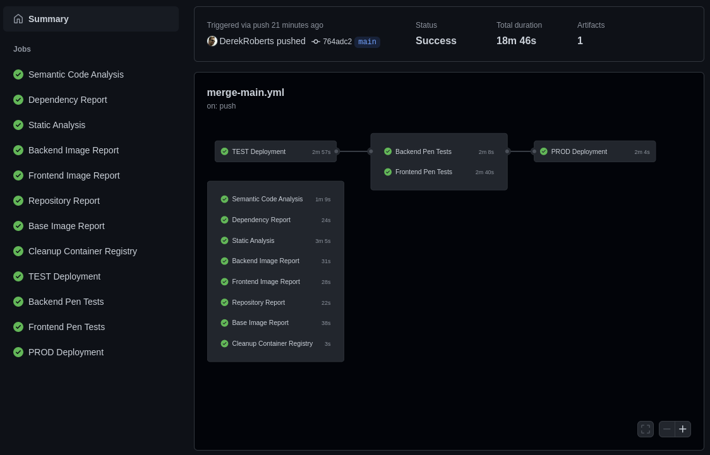

<!-- PROJECT SHIELDS -->

# Greenfield Template - DevOps Quickstart

## Overview

The Greenfield-template is a fully functional set of pipeline workflows and a starter application stack intended to help Agile DevOps teams hit the ground running.  Currently supports OpenShift with plans for AWS (Amazon Web Services).  Pipelines are run using [GitHub Actions](https://github.com/bcgov/greenfield-template/actions).

Features:
* Pull Request-based pipeline
* Sandboxed development deployments (OpenShift)
* Gated production deployments (OpenShift)
* Container publishing (ghcr.io) and importing (OpenShift)
* Security, vulnerability, infrastructure and container scan tools
* Automatic dependency patching with Pull Requests
* Gatekeeping based on code reviews and pipeline checks
* Templates and setup documentation
* Starter TypeScript application stack

This project is in active development.  Please visit our [issues](https://github.com/bcgov/greenfield-template/issues) page to view or request features.

### Deployments

Out of the box sandboxed, pull request-based development deployments allowing for multiple developers to work on and see their features at once.

Deployment to production is gatekept using GitHub environments, requiring sign off from code maintainers.

Deployment to test, staging or pre-prod (pick a name!) is currently planned to be transitory, allowing access to gatekept data, but only stopping before production deployment if a failure occurs.  (work in progress)

### Testing

Unit tests are run in jest, but other test frameworks can always be installed.  SonarCube should be configured to pick up sarif files and provide coverage reports.

### Code Quality

Code quality and coverage reporting are performed by:

* SonarCloud
* CodeQL

### Security Scanning

Dependency, container and vulnerability scanning is performed by:

* Trivy
* Snyk
* OWASP ZAP

### Dependency patching

Dependency patching is performed by:

* Snyk

## Pull Request Opened/Modified

This workflow is triggered when a Pull Request to the main branch is created or modified.  Each development deployment is separate, using its own stack.  This avoids collisions between development environments and provides isolation for testing and experimentation.  Pipeline steps are enforced, preventing merge of failing code.

The workflow, located [here](https://github.com/bcgov/greenfield-template/blob/main/.github/workflows/pr-open.yml), includes:

* [Pull Request](https://github.com/bcgov/greenfield-template/pulls)-based ephemeral, sandboxed environments
* [Docker](https://github.com/marketplace/actions/build-and-push-docker-images)/[Podman](https://podman.io) container building
* [Build caching](https://github.com/marketplace/actions/cache) to save time and bandwidth
* [GitHub Container Registry](https://github.com/bcgov/greenfield-template/pkgs/container/greenfield-template) image publishing
* [RedHat OpenShift](https://www.redhat.com/en/technologies/cloud-computing/openshift) deployment, with other options under consideration
* [Jest](https://jestjs.io/) JavaScript testing enforced in-pipeline
* [SonarCloud](https://sonarcloud.io/) Code test coverage reporting
* [Tryvy](https://aquasecurity.github.io/trivy) image/infrastructure vulnerability/config scanning
* [OWASP ZAP](https://www.zaproxy.org/) Zed Attack Proxy live application scanning
* [Snyk](https://snyk.io/) vulnerability scalling and dependency patching

### Pull Request Future State

Several improvements are on the way:

* Smoke testing
* End-to-end testing
* Gatekeeping before entering test or production
* [ESLint](https://eslint.org/) linting

Please [read or submit issues](https://github.com/bcgov/greenfield-template/issues) to help shape this project!

## Pull Request Cleanup Pipeline

The workflow, located [here](https://github.com/bcgov/greenfield-template/blob/main/.github/workflows/pr-close.yml), includes:

* OpenShift dev artifact pruning
* ghcr.io cleanup of dev images over 14 days-old

## Pull Request Main Merge Pipeline

The workflow, located [here](https://github.com/bcgov/greenfield-template/blob/main/.github/workflows/main.yml), includes:

* [GitHub CodeQL](https://codeql.github.com/) semantic code analysis and vulerability scanning
* [SonarCloud](https://sonarcloud.io/) continuous code quality and security scanning
* [Snyk](https://snyk.io/) vulnerability scanning for containers, infrastructure and dependencies

## Starter Application

The starter stack includes a frontend, backend and postgres database.  The frontend and backend are buld with [NestJS](https://docs.nestjs.com).  They currently do very little, but provide placeholders for more functional products.  See the backend and frontend folders for source, including Dockerfiles.

Features:
* [TypeScript](https://www.typescriptlang.org/) strong-typing for JavaScript
* [NestJS](https://docs.nestjs.com) frontend and backend
* [ESLint](https://eslint.org/) linting enforced on code staging (currently disabled)
* [Postgres](https://www.postgresql.org/) database

Local development can be supported using Docker Compose.  Please be aware that Podman and Podman Compose work as drop-in replacements for the Docker counterparts.

`docker-compose up -d`

# Getting Started

Initial setup is intended to take four hours or less.  This depends greatly on intended complexity, features selected/excluded and outside cooperation.

## Contents

* Documentation:
    * *.md
* Workflows:
    * Pull Request-based (.github/workflows/pr-open.yml)
    * On Close (.github/workflows/pr-close.yml)
    * Main Merge (.github/workflows/main.yml)
* Hello World! starter application
    * TypeScript source in src/
    * One Jest test in test/
    * JavaScript container in Dockerfile
* Misc:
    * nestjs
    * eslint (temporarily disabled)
    * lint-staged (temporarily disabled)

Not included:

* Repository secrets
* Environment secrets
* Issues
* Pull requests
* JavaScript (transpiled/created in dist/)

Please read [our setup guide](./GETTING_STARTED.md) for more information.

## Example APIs, UIs and Metabase/Oracle Templates

Templates for APIs, UIs and Metabase/Oracle can be used to kickstart or extend projects.  Please visit our collaborators' [NR Architecture Templates](https://github.com/bcgov/nr-arch-templates) repository for more information.
